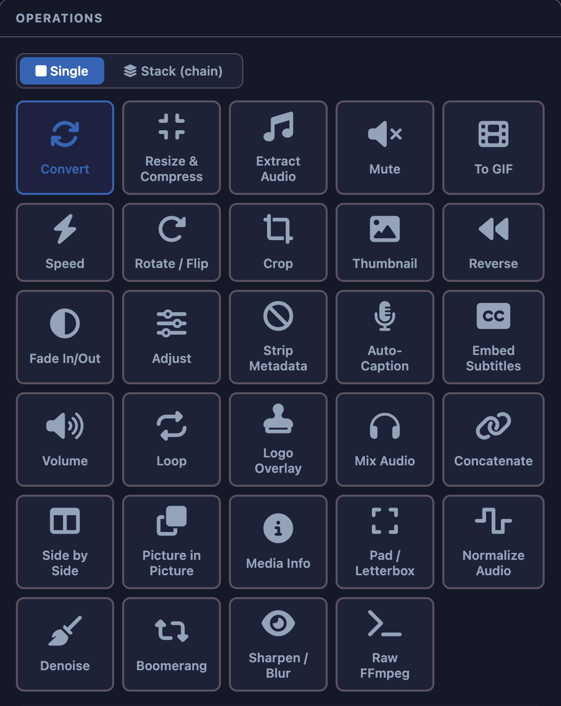

# ffmpeg webCLI

[](https://github.com/tejaswigowda/ffmpeg-webCLI/stargazers)

A browser-based video editor powered by [ffmpeg.wasm](https://github.com/ffmpegwasm/ffmpeg.wasm). <b><ins>No uploads, no servers -- all processing happens locally</ins></b> in your browser using WebAssembly.

▶ **Live app:** https://tejaswigowda.com/ffmpeg-webCLI/

---

## Key Features




✓ **No Server Uploads** : All video processing happens entirely on your device

✓ **32+ Video Operations** : GIF creation, format conversion, compression, trimming, effects, filters, auto-captioning, and more

✓ **Batch Processing** : Process multiple videos at once with the same operation - or an entire **operation chain** - applied to every file; real-time progress, per-file preview, individual downloads, ZIP-all, and graceful fallback

✓ **Offline-First PWA** : Works completely offline after first use; install as a native app

✓ **Screen Wake Lock** : Screen stays active during video processing on any device

✓ **Live Previews** : See output size estimates and live settings adjustments

✓ **Multi-Format Support** : MP4, WebM, MKV, MOV, AVI, GIF, MP3, AAC, WAV, OGG, FLAC, JPG, PNG

✓ **Advanced Features** : Raw ffmpeg command access, subtitle embedding, concatenation, picture-in-picture, audio mixing

✓ **Fast & Responsive** : Uses Web Workers for background processing

✓ **Privacy First** : Zero data collection; works with your files locally

---

## What It Replaces

| Tool | What you replace |
|---|---|
| CloudConvert | Format conversion, compression, audio extraction |
| Kapwing | Trim, crop, speed, reverse, fade, filters |
| Clideo | Trim, compress, merge, mute, loop |
| Ezgif | GIF maker, reverse, resize, crop, optimize |
| Online-convert.com | Format conversion across video/audio |
| MP3cut / Audiotrimmer | Audio extraction and trimming |
| Metadata2go | Strip metadata |
| Subtitle Horse | Embed subtitles |
| Kapwing (side-by-side) | Side by side, picture-in-picture |
| Rev / Scribd | Auto-captioning, transcript editing |
| Loudnorm tools | Audio normalization |

**The difference that matters:** every one of those tools uploads your file to a
server. Some are free with ads, some charge -- but all of them *see your file*, and
all are subject to data breaches, subpoenas, and privacy-policy changes.

ffmpeg-webCLI covers the common tasks of all of them, for free, with files that
**never leave your device**.


---

## Use Cases

### ⛓ Operation Chaining (Stack Mode)
Stack several compatible operations and run them in a **single pass**. Switch the Operations panel to **Stack (chain)** mode, configure an op, and click **Add to Stack** to queue it. The queue is an ordered, reorderable list - move items up/down or remove them - and a live **composed command preview** shows the exact `ffmpeg` invocation before you run it.

All stacked operations are merged into one filter chain (`-vf "a,b,c"` / `-af "x,y"`) and encoded **only once**, so quality loss from repeated re-encoding is avoided. Any active trim is applied first as input seeking, then the chain runs, then the single encode targets your chosen output format. For example, crop → grayscale → convert-to-MP4 becomes:

```
ffmpeg -i input.mp4 -vf "crop=1280:720:0:0,eq=brightness=0:contrast=1:saturation=0" -c:v libx264 -preset fast -c:a aac output.mp4
```

**Chainable:** Crop, Resize, Rotate/Flip, Adjust (brightness/contrast/saturation), Grayscale, Fade, Denoise, Sharpen/Blur, Speed, Pad/Letterbox and Volume - every single-input, frame-wise video/audio filter.

**Not chainable** (use Single mode): multi-input operations (Concatenate, Side by Side, Picture in Picture, Mix Audio, Embed Subtitles, Logo Overlay) and whole-file or different-output operations (GIF, Thumbnail, Boomerang, Media Info). These are disabled in Stack mode with an inline explanation.

**Chaining + batch together:** Stack mode and batch mode combine - enable **Batch**, queue several files, switch to **Stack (chain)**, build your chain once, and click **Process Stack** to apply the *entire* chain to *every* queued file. Each file is composed against its own dimensions/duration (so crop, pad, and fade resolve per file) and encoded in a single pass, with results shown in the batch outputs panel.

### ▶ Batch Processing
Process multiple video files with the same operation in a single session. Click the **Batch** toggle in the Input Video card to enable batch mode, then drop or select multiple files. Each file is queued with a status indicator:
- ⏳ **Pending** : queued, waiting to process
- ▶ **Processing** : currently encoding
- ✓ **Done** : completed successfully
- ✗ **Error** : encountered an issue

When you click **Process Queue**, ffmpeg runs through each file sequentially. The log shows real-time progress: `[X/total] Processing: filename`. Completed files appear in the **Batch Outputs** panel of the Output section, where you can pick any file to preview it in the player, download files individually, or grab everything at once with **ZIP All** - no need to wait for the entire batch to finish before downloading completed files.

**Batch + Stack (chaining):** Batch isn't limited to a single operation. Switch the Operations panel to **Stack (chain)** while batch mode is on, build a chain, and **Process Stack** applies the whole chain to every queued file in one pass each. See [Operation Chaining](#-operation-chaining-stack-mode) above.

**Graceful Fallback:** If you have a video already loaded and enable batch mode, the app automatically adds it to the queue so you don't lose your work.

**Supported Operations in Batch Mode** (25 total):
- All single-input filters: Resize, Speed, Fade, Denoise, Sharpen/Blur, Adjust, Grayscale, Rotate/Flip, Volume, Pad, Audio Extract, Mute, Strip Metadata, Loop, Normalize Audio
- Format conversion and compression across all output formats (MP4, WebM, MKV, MOV, AVI, GIF, MP3, AAC, WAV, OGG, FLAC)

**Unsupported in Batch Mode** (operations require per-file configuration, multi-input coordination, or cause memory constraints):
- **Crop** : Dimension-dependent; different videos may need different crop values
- **Overlay** (Logo) : Requires selecting a separate image file for each batch item
- **Multi-input ops** : Concatenate, Side by Side, Picture in Picture, Mix Audio, Embed Subtitles
- **Memory-intensive** : Reverse (requires full-video buffering + re-encoding; with multiple large files in batch, risks hitting the 2GB memory ceiling and crashing)
- **Whole-file effects** : Boomerang (special reversal effect)
- **Informational** : Media Info (displays metadata, doesn't process)
- **Unpredictable** : Raw FFmpeg (user-defined commands differ per file)

These operations are visually greyed out in batch mode to prevent accidental selection.

### ▶ GIF Maker
Convert any video clip into an animated GIF. Set the frame rate and output width; height scales automatically to preserve the aspect ratio. Uses a two-pass palette generation for the best possible color quality.


### ↻ Video Format Converter
Re-encode a video to a different container and codec:
- **MP4** : H.264 + AAC, widest compatibility
- **WebM** : VP9 + Opus, open format optimised for the web (~45% smaller than MP4 at similar quality)
- **MKV / MOV** : H.264 + AAC in alternative containers
- **AVI** : legacy compatibility

### ⊟ Video Compression
Reduce file size without changing the resolution. Dial in the quality with a **CRF slider** (18 = near-lossless → 51 = maximum compression) and pick an encoding **preset** (ultrafast → veryslow) to trade encoding speed for compression efficiency. A live size estimate updates as you adjust the settings.

### ▤ Video Trimming
Set a start and end point with the timeline sliders before running any operation. Trimming is applied on top of every other operation, so you can, for example, extract a short clip, compress it, and convert it to GIF all at once.

### ⊞ Resize & Compress
Change the output dimensions and compress in one pass. Width and height are auto-filled from the source video; edit either value or leave it blank to let ffmpeg maintain the aspect ratio. Combines a `scale` filter with CRF-based H.264 encoding.

### ♪ Audio Extraction
Pull the audio track out of any video into a standalone audio file:
- **MP3** : universal playback
- **AAC** : efficient lossy, great for mobile
- **WAV** : uncompressed PCM
- **OGG Vorbis** : open lossy format
- **FLAC** : lossless compression

### ⊘ Mute Video
Strip the audio stream entirely. Output is the original video with no audio track -- useful for silent loops, social media clips, or before replacing the audio elsewhere.

### ▶ Speed Change
Speed up or slow down playback (0.25× – 4×). Both the video PTS and the `atempo` audio filter chain are adjusted so audio pitch and sync are preserved. Chains multiple `atempo` stages automatically when the multiplier is outside the 0.5–2.0 range that a single filter accepts.

### ↻ Rotate / Flip
Correct orientation or create mirror effects without re-uploading. Options: 90° clockwise, 90° counter-clockwise, 180°, flip horizontal, flip vertical, or flip both axes.


### ▤ Crop
Trim the frame to a specific region. X/Y offset and width/height are auto-filled from the source video dimensions so you can immediately drag values down rather than starting from scratch.

### ▭ Thumbnail Extractor
Pull a single frame from any point in the video and save it as a **JPEG** or **PNG** image. The timestamp field is pre-filled to the midpoint of the loaded clip.

### ⟲ Reverse
Play the video (and audio) backwards using ffmpeg's `reverse` + `areverse` filters. The reverse filter buffers the entire video into memory for processing, which combined with re-encoding makes it memory-intensive. Works in single mode; **not supported in batch mode** to prevent memory exhaustion when processing multiple large files (risk of hitting the 2GB WebAssembly heap limit).

### ▨ Fade In / Out
Add a smooth fade-in, fade-out, or both. Set the duration in seconds for each direction independently; the filter is applied after any trim.

### ◉ Adjust (Brightness / Contrast / Saturation)
Fine-tune the look of a clip with the `eq` filter. Three sliders control brightness (−1 → 1), contrast (0 → 2), and saturation (0 → 3). A **Grayscale** checkbox pins saturation to zero for instant black-and-white output.

### ✕ Strip Metadata
Remove all embedded metadata -- GPS coordinates, camera make/model, creation timestamps, and any other tags -- before sharing a file. Uses `-map_metadata -1` during re-encoding.

### ▢ Embed Subtitles
Mux an `.srt`, `.vtt`, or `.ass` subtitle file into the video as a **soft subtitle track** -- toggleable on/off in any media player (VLC, browser, etc.) without re-encoding the picture. Output format choices:
- **MP4** : subtitle stream encoded as `mov_text`
- **MKV** : subtitle stream copied natively (preserves ASS/SSA styling)

Video and audio are stream-copied (zero quality loss, near-instant). Hard-burning subtitles into the picture requires a libass-enabled ffmpeg build and is not available in the standard WebAssembly core.

### ◉ Auto-Caption (Whisper)
Generate **automatic captions** from speech using [OpenAI's Whisper](https://openai.com/research/whisper) model via [Transformers.js](https://xenova.github.io/transformers.js/). Transcription runs entirely in your browser—your audio never leaves your device. Model weights are cached locally in IndexedDB after the first download, and the library is cached by the service worker for offline use. Edit the transcript before embedding it as soft subtitles.

**Workflow:**
1. **Extract** : Audio is extracted from the video at 16 kHz mono
2. **Transcribe** : Whisper processes the audio in 30-second chunks with 5-second overlap to generate accurate captions
3. **Review & Edit** : Transcript appears in a textarea as SRT format - edit any caption before embedding
4. **Embed** : Click **Confirm & Embed** to mux the subtitles as a soft track into the output video (same format options as Embed Subtitles)

**Model Selection** (choose speed vs. accuracy):
- **Tiny** (39 MB) : Fastest, lower quality - good for quick turnarounds or speech-only content
- **Base** (140 MB) : Balanced speed and accuracy - recommended for most videos
- **Small** (466 MB) : Higher quality, slower - best for heavily accented or technical speech

Models are lazy-loaded and cached on first use (~15–30 seconds for initial download, then instant on subsequent runs).

**Output Format:**
- **MP4** : subtitle stream encoded as `mov_text`
- **MKV** : subtitle stream copied natively

**Key Features:**
- ✓ Audio never leaves your device (no uploads, no API calls)
- ✓ Transcription runs entirely in-browser after initial model download
- ✓ Generates SRT timestamps with millisecond precision
- ✓ Edit captions directly in the textarea (reset or confirm changes)
- ✓ Real-time progress bar (0–100%) during transcription
- ✓ Sequential memory management: Whisper model is disposed before FFmpeg re-engages to prevent out-of-memory errors
- ✓ Works with any video duration or language (defaults to English, auto-detectable per Whisper)

### ◆ Volume
Boost or reduce the audio level of any video. A single slider sets the **volume multiplier** (0 = silence, 1.0 = unchanged, up to 4×). Audio is re-encoded using the `volume` filter; the video stream is stream-copied (no quality loss, no re-encode overhead).

### ⟲ Loop / Repeat
Play the video N times back-to-back in a single output file. Set **Total plays** (2–50); ffmpeg uses `-stream_loop` with stream copy so there is no re-encoding and the output file is proportionally larger. Trim is not applied for this operation. **Supported in batch mode** - each video loops independently with minimal memory overhead, making it safe and efficient for batch processing repeated content.

### ▭ Logo / Image Overlay
Stamp a logo, watermark, or any image (PNG with transparency works best) onto every frame. Controls:
- **Image file** : any PNG, JPG, GIF, or WebP
- **Position** : bottom-right, top-left, top-right, bottom-left, or centre
- **Width (% of video)** : scales the logo relative to the video width (default 15%)

Uses the `overlay` filter with a `scale` pre-pass. Video is re-encoded; audio is stream-copied.

### ♪ Mix Audio (Background Music)
Blend a second audio file into the video as background music. Controls:
- **Music / audio file** - MP3, WAV, OGG, AAC, FLAC, M4A
- **Original audio volume** slider (0–2, default 1.0)
- **Music volume** slider (0–2, default 0.30)

The music track loops automatically via `-stream_loop -1` if it is shorter than the video. Both streams are mixed with the `amix` filter (`duration=first` so output matches the video length). Video is stream-copied.

### ⊲⊲ Concatenate (Join Clips)
Append a second video clip after the loaded file. Uses the `concat` filter with H.264/AAC re-encoding, so clips with different resolutions, frame rates, and codecs are handled automatically. Trim applies to the first clip only; the second clip is taken in full.

### ↔ Side by Side
Place two video clips next to each other in a single frame:
- **Layout** : Horizontal (left / right using `hstack`) or Vertical (top / bottom using `vstack`)
- **Common dimension** : target height in pixels for horizontal layout, or target width for vertical layout (both clips are scaled to match)
- **Audio** : take from the first clip, the second clip, or output no audio

Re-encodes to H.264/AAC. Useful for comparison videos, reaction videos, and split-screen content. Trim is ignored.

### ▣ Picture in Picture
Overlay a second video on top of the main clip in a small inset window. Controls:
- **Overlay video** : the smaller video to appear as the inset
- **Position** : corner or centre (same options as Logo Overlay)
- **Width (% of main video)** : controls the inset size (default 30%)

The overlay video loops automatically if it is shorter than the main clip. Trim applies to the main clip. Audio from the main clip is preserved. Both streams are re-encoded to H.264/AAC.

### ▦ Media Info
Displays key metadata extracted from the browser's video element immediately when a file is loaded:
- File name, size, duration, resolution, estimated bitrate, and MIME type

Click **Process Video** to run a **deep scan** (`ffmpeg -hide_banner -i …`) and print full codec, stream, pixel format, and container details to the log panel below.

### ◎ Raw FFmpeg
Full access to the ffmpeg command line directly in the browser. Type any arguments into the text area; they are inserted after `-i input` and before the output filename. Choose the output file extension and optionally bypass the trim range. A live **full command preview** updates as you type, showing the exact command that will be executed. Quoted values containing spaces are handled correctly.


An **Example Commands** library (collapsible) provides one-click recipes to get started:

| Example | What it does |
|---|---|
| ▢ Color-bar watermark | Semi-transparent `drawbox` stamp in the bottom-right corner |
| ▶ Cap framerate to 24 fps | `fps=24` filter + H.264 re-encode |
| ◎ Convert to grayscale | `format=gray` + H.264 re-encode |
| ◆ Loudness normalize | `loudnorm` filter, stream-copies video |
| ◇ Lossless remux (copy) | `-c copy` - change container, zero quality loss |
| ⊞ Letterbox / pillarbox | Scales to 1920×1080, pads with black bars |
| ≈ Denoise (hqdn3d) | Temporal + spatial denoising |
| ◉ Sharpen (unsharp) | `unsharp` mask filter |
| ⊗ Stabilize (deshake) | `deshake` motion stabilization |
| ⊕ Vignette effect | `vignette` filter darkens edges |
| ⊘ Extract audio as WAV | `-vn -acodec pcm_s16le` lossless audio export |
| ▭ Extract first frame | `-vframes 1` saves a single PNG |
| ♪ Replace audio track | Strips original audio and muxes in `input2.mp3`; uses `-map 0:v:0 -map 1:a:0 -shortest` |

Clicking a recipe fills in the arguments and extension fields instantly.

> **Second input file** : the Raw FFmpeg panel includes an optional *Choose file* picker. The selected file is written to ffmpeg's virtual filesystem as `input2.<ext>` and can be referenced in your arguments (e.g. `-i input2.mp3`). Required by the *Replace audio track* recipe.

### ▢ Pad / Letterbox
Add colored bars to bring a video to a specific aspect ratio without cropping or stretching it. The video is scaled down to fit entirely inside the target canvas; empty space is filled with the chosen pad color.

| Target Ratio | Typical use |
|---|---|
| 16:9 | YouTube, TV, most monitors |
| 9:16 | Instagram / TikTok Reels, Stories |
| 1:1 | Instagram square feed |
| 4:3 | Classic TV / legacy formats |
| 4:5 | Instagram portrait feed |
| 21:9 | Cinematic / ultrawide |

Pad colors: **Black**, **White**, **Gray**. Re-encodes to H.264/AAC.

### ▦ Normalize Audio
Bring the perceived loudness of a clip to a broadcast-standard target using ffmpeg's `loudnorm` (EBU R128) filter. Choose a target integrated loudness level:

- **-14 LUFS** : YouTube / Spotify recommended level
- **-16 LUFS** : Podcasts / Apple Podcasts
- **-23 LUFS** : Broadcast standard (EBU R128)

The video stream is stream-copied (no re-encode); only the audio is processed.

### ∿ Denoise
Reduce video noise with the `hqdn3d` (high-quality 3D denoise) filter, which combines spatial and temporal noise reduction. Three presets:

| Strength | Parameters | Best for |
|---|---|---|
| Light | `2:2:3:3` | Mild grain, HDR content |
| Medium | `4:4:6:6` | Standard noise removal |
| Heavy | `10:10:15:15` | Heavy noise / low-light footage |

Re-encodes video with H.264; audio is stream-copied.

### ⇄ Boomerang
Creates the classic boomerang loop effect: the clip plays **forward then immediately in reverse** in a single output file. Uses ffmpeg's `reverse` filter concatenated with the original via the `concat` filter. Trim is respected for the forward segment. Audio is removed (the reverse of audio rarely sounds intentional).

### ◉ Sharpen / Blur
Apply a sharpening or blur effect to the entire video.

- **Sharpen** uses the `unsharp` mask filter (luma + chroma):
  - Light: `unsharp=3:3:0.8:3:3:0`
  - Medium: `unsharp=5:5:1.5:5:5:0`
  - Heavy: `unsharp=7:7:3:7:7:0`
- **Blur** uses the `boxblur` filter:
  - Light: `boxblur=3:1`
  - Medium: `boxblur=6:1`
  - Heavy: `boxblur=12:1`

Video is re-encoded to H.264; audio is stream-copied.

---

## Acknowledgments

This project is maintained with community feedback. Key features and improvements from user requests and contributions:

- **Operation Chaining (Stack Mode)** - [#2](https://github.com/tejaswigowda/ffmpeg-webCLI/issues/2): Queue and compose multiple compatible operations into a single filter chain and execute in one pass, avoiding quality loss from repeated re-encoding.
- **Batch + Chaining**: Stack mode and batch mode now work together - apply a full operation chain to every file in a batch, with per-file preview, individual downloads, and ZIP-all.
- [PR #1](https://github.com/tejaswigowda/ffmpeg-webCLI/pull/1): Community contributions and improvements to the codebase.

---

## How It Works

**Local Processing:**
1. Click **Load ffmpeg** : downloads the ffmpeg-core WebAssembly binary (~31 MB, cached after first load).
2. Drop or select a video file. The **Process Video** button activates; if ffmpeg is not yet loaded it reads **Load ffmpeg & Process** and will download it automatically on first click.
3. Optionally set trim points with the timeline sliders.
4. Pick an operation and adjust its settings. A **live size estimate** updates as you change parameters.
5. Click **Process Video** : ffmpeg runs entirely in a Web Worker inside your browser.
6. Preview the result (video, audio player, or image depending on the operation) and download it.

All file I/O stays on your machine. Nothing is sent to any server.

**Performance & Reliability:**
- Video processing runs in background workers -- the UI stays responsive
- Screen automatically stays active during long encoding operations
- Service worker caches all static assets and CDN resources for instant offline access
- Failed operations automatically clean up virtual filesystem

---

## ⊞ Progressive Web App (PWA)

The editor works **completely offline** with intelligent caching and screen wake lock support:

### Features
- **⊕ Install as App** : Use the browser's native install button to add the app to your home screen or app drawer. Works on desktop and mobile.
- **◆ Offline Support** : Once ffmpeg is loaded and cached, all processing works without an internet connection.
- **▶ Smart Caching**
  - Static assets (HTML, CSS, JS) are cached on first load
  - ffmpeg.wasm library and dependencies are cached from CDN for offline use
  - Service worker intercepts requests and serves from cache when network is unavailable
- **⊞ Screen Wake Lock** : The screen automatically stays on during video processing. Prevents device sleep or lock on mobile and desktop during encoding.
- **◇ Works Everywhere**
  - Chrome, Edge, Firefox, Safari on desktop
  - Chrome, Firefox, Samsung Internet on Android
  - Safari on iOS (iOS PWA support is limited but available)

### How to Use as PWA
1. **Web browser:** Visit the app at https://tejaswigowda.com/ffmpeg-webCLI/
2. **Install:** Click the install button in your browser's address bar or menu → confirm installation
3. **Use offline:** Load ffmpeg once online, then work offline without internet connection
4. **Screen stays active:** Processing automatically keeps your screen on to prevent interruptions

---

## Running Locally

```bash
git clone https://github.com/tejaswigowda/ffmpeg-webCLI
cd ffmpeg-webCLI
node server.js          # serves docs/ with the required COOP/COEP headers
```

The server sets `Cross-Origin-Opener-Policy: same-origin` and `Cross-Origin-Embedder-Policy: require-corp`, which are required for `SharedArrayBuffer` (used by ffmpeg.wasm).

Or serve the `docs/` folder with any static server that sets those two headers:

```bash
# Alternative: using npx serve
npx serve docs
```

---

## License

This project is licensed under the **GNU General Public License v3.0** (GPL-3.0). See [LICENSE](LICENSE) for details.

### License Summary

You are free to:
 ✓ Use this software for any purpose

 ✓ Study and modify the source code  

 ✓ Distribute copies of the software

 ✓ Distribute modified versions

With the requirement that you:

 ▢ Include a copy of the license

 ✎ Document changes made to the code

 ◆ Make source code available when distributing

This project builds on [ffmpeg.wasm](https://github.com/ffmpegwasm/ffmpeg.wasm) (LGPL-2.1) which is built from [FFmpeg](https://ffmpeg.org/) (LGPL-2.1+).
