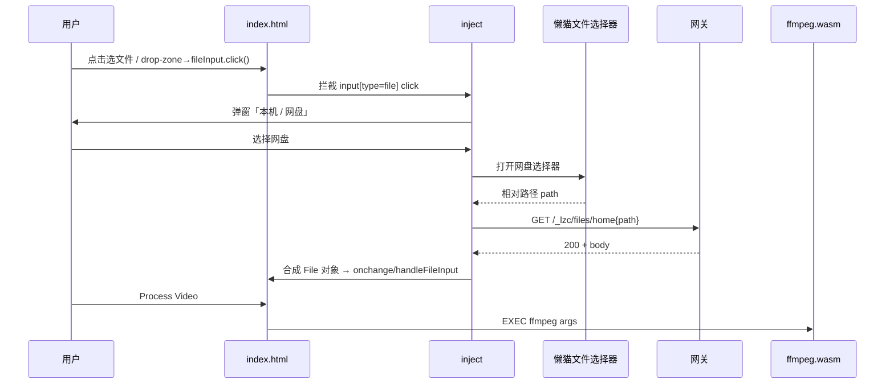
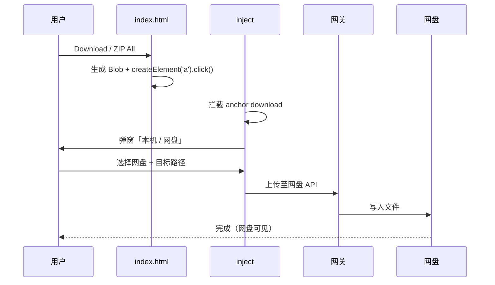
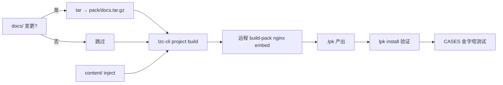

# ARCH：FFmpeg 浏览器剪辑 × 懒猫网盘 — 架构文档

| 项 | 内容 |
|---|---|
| **关联 PRD** | [PRD-NETDISK.md](./PRD-NETDISK.md) |
| **关联用例** | [CASES-NETDISK.md](./CASES-NETDISK.md) |
| **版本** | v1.1.0-arch |
| **更新** | 2026-06-17 |

---

## 1. 架构原则

| 原则 | 说明 |
|---|---|
| **Local-first** | 转码算力 100% 在浏览器 ffmpeg.wasm，NAS 不跑 ffmpeg |
| **Zero upstream change (P1)** | Phase 1 不改 `docs/index.html`，网盘能力由 LPK 层 inject 注入 |
| **Dual-channel I/O** | 任意文件入口保留「本机 + 网盘」双通道 |
| **Fail-safe deploy** | 静态 nginx 无 healthcheck；路由用 service 名 `web:8080` |
| **GPL traceability** | 上游 fork + 官方 inject 脚本来源可追溯 |

---

## 2. 系统上下文（C4 Level 1）

```mermaid
flowchart TB
    subgraph User["用户设备（浏览器）"]
        UI[ffmpeg-webCLI UI]
        WASM[ffmpeg.wasm Worker]
        INJ[lzc-file-chooser-inject]
        UI --> INJ
        UI --> WASM
    end

    subgraph LZC["懒猫微服 NAS"]
        GW[app 网关 :80]
        WEB[web nginx :8080]
        PKG[/lzcapp/pkg/content]
        DISK[懒猫网盘存储]
        GW -->|http://web:8080| WEB
        WEB -->|静态| UI
        PKG -->|inject.js| INJ
    end

    INJ -->|GET /_lzc/files/home/...| GW
    INJ -->|PUT 保存| GW
    GW --> DISK
    INJ -->|File/Blob| UI
    WASM -->|Blob 输出| INJ
```

**边界说明**：

- 浏览器 ↔ NAS：仅 HTTPS + 用户已登录会话，无第三方云  
- NAS **不参与**编解码，只提供静态托管 + 网盘文件 HTTP API  

---

## 3. 容器部署拓扑（C4 Level 2）

```text
┌─────────────────────────────────────────────────────────────┐
│  LPK: cloud.lazycat.app.ffmpeg-webcli                       │
│  Network: cloudlazycatappffmpeg-webcli_default                │
├─────────────────────────────────────────────────────────────┤
│  app-1 (lzcapp 网关)                                          │
│    · 监听 :80 / :81                                           │
│    · 路由: / → http://web:8080                                │
│    · inject 在 browser 阶段注入 content 内脚本                  │
│    · Health: lzcinit -healthcheck ✅                          │
├─────────────────────────────────────────────────────────────┤
│  web-1 (embed:ffmpeg-webcli)                                  │
│    · nginx :8080                                              │
│    · /usr/share/nginx/html ← docs.tar.gz                      │
│    · COOP/COEP headers                                        │
│    · 无 healthcheck（nginx 镜像无 wget）                       │
└─────────────────────────────────────────────────────────────┘
         ▲ HTTPS 用户访问 ffmpeg.{box}.heiyu.space
```

### 3.1 镜像分层

```text
registry.lazycat.cloud/.../nginx:54809b2f36d0ff38   ← 上游混合分发
  + lzc/images/nginx.conf                            ← COOP/COEP + /healthz
  + lzc/pack/docs.tar.gz                             ← 上游 docs/ 静态资源
```

### 3.2 LPK 包结构（v1.1.0 增量）

```text
cloud.lazycat.app.ffmpeg-webcli-v1.1.0.lpk
├── package.yml
├── manifest.yml
├── icon.png
├── images/                    # embed OCI layers
└── content/                   # contentdir 新增
    └── lazycat-injects/
        └── lzc-file-chooser-inject.js
```

---

## 4. 逻辑分层架构

```text
┌──────────────────────────────────────────────────────────┐
│ L4 体验层     │ 弹窗文案 zh-CN / usage 说明 / 错误 toast   │
├──────────────────────────────────────────────────────────┤
│ L3 集成层     │ inject 拦截 file input + anchor download │
├──────────────────────────────────────────────────────────┤
│ L2 应用层     │ docs/index.html — 32+ ffmpeg 操作         │
├──────────────────────────────────────────────────────────┤
│ L1 运行时层   │ ffmpeg.wasm worker / Whisper / ServiceWorker│
├──────────────────────────────────────────────────────────┤
│ L0 平台层     │ LPK manifest / nginx / 懒猫网关 / 网盘 API  │
└──────────────────────────────────────────────────────────┘
```

| 层 | 网盘对接改动点 |
|---|---|
| L0 | `contentdir`、`injects`、`file_handler`(P2) |
| L1 | 无改动 |
| L2 | Phase 2 可选：`?file=` URL 入参解析 |
| L3 | 引入官方 inject，hooks 全开 |
| L4 | manifest `usage` + inject `text` 中文化 |

---

## 5. 数据流

### 5.1 输入：网盘 → 浏览器



### 5.2 输出：浏览器 → 网盘



### 5.3 Phase 2：file_handler 深链

```text
网盘右键 MP4
  → 系统调起 cloud.lazycat.app.ffmpeg-webcli
  → GET /?file=%u  （%u = 网盘 URL 编码路径）
  → index.html 启动脚本 fetch /_lzc/files/home{path}
  → loadFile → 正常剪辑流程
```

---

## 6. 组件规格

### 6.1 nginx（web service）

| 项 | 值 |
|---|---|
| 端口 | 8080 |
| 根目录 | `/usr/share/nginx/html` |
| 必需响应头 | COOP、COEP、CORP |
| 探活 | `/healthz` 仅人工/debug，**不配 Docker healthcheck** |

### 6.2 inject（browser）

| 参数 | 值 | 说明 |
|---|---|---|
| `src` | `file:///lzcapp/pkg/content/lazycat-injects/lzc-file-chooser-inject.js` | 随 LPK 分发 |
| `diskRoot` | `/_lzc/files/home` | 网盘 HTTP 根 |
| `hooks.fileInput` | `true` | 覆盖全部 `<input type=file>` |
| `hooks.fileSystemAccess` | `true` | 预留 File System Access API |
| `locale` | `auto` | 中英文弹窗 |

### 6.3 文件入口映射

| DOM ID | 操作类型 | inject 覆盖 |
|---|---|---|
| `#fileInput` | 主视频 / Batch | ✅ |
| `#subtitleFileInput` | 字幕 | ✅ |
| `#overlayFileInput` | Logo | ✅ |
| `#mixAudioFileInput` | BGM | ✅ |
| `#concatFileInput` | 拼接 | ✅ |
| `#sxsFileInput` | 并排 | ✅ |
| `#pipFileInput` | 画中画 | ✅ |
| `#rawInput2` | Raw 第二输入 | ✅ |
| `#dropZone` drag-drop | 拖拽 | ❌ Phase 1 |
| `download()` | 输出 | ✅ |

---

## 7. 安全与隔离

|  Concern | 机制 |
|---|---|
| 跨域隔离 | COOP + COEP → `crossOriginIsolated=true` → SharedArrayBuffer |
| 鉴权 | 懒猫 HTTPS 会话；`/_lzc/files/` 走网关鉴权 |
| 数据出境 | 无第三方；wasm 在客户端，网盘在用户 NAS |
| inject 来源 | 官方 developer.lazycat.cloud 脚本，checksum 入 git |
| CSP | 随 nginx 静态托管；inject 同域 `lzcapp/pkg` |

---

## 8. 构建与发布流水线



**约束**：

- `context: ..` 时 embed 只打包 Dockerfile COPY 路径 → 必须 `docs.tar.gz`  
- 中文路径下不用 bash buildscript，PowerShell 手动 tar  
- 路由禁止 FQDN，用 `http://web:8080`  

---

## 9. 分期架构演进

```text
v1.0.0  ──►  静态 nginx + wasm（无网盘）
              │
v1.1.0  ──►  + contentdir + inject（I/O 双通道）
              │
v1.2.0  ──►  + file_handler + ?file= 深链
              │
v1.3.0  ──►  + UI 文案 / 大文件提示 / 错误层
              │
v1.4.x  ──►  （可选）内嵌 wasm 去 CDN 依赖 — 独立 ARCH 修订
```

---

## 10. 架构决策记录（ADR）

| ID | 决策 | 理由 | 放弃方案 |
|---|---|---|---|
| ADR-01 | Phase 1 用 inject 不改 upstream | 最小 diff、易合并上游 | 改 index.html 接 lzc-file-picker 组件 |
| ADR-02 | 不做 NAS 端 ffmpeg | 与产品「100% local」定位一致 | Node/Python 转码 sidecar |
| ADR-03 | embed 用 docs.tar.gz | lzc build-pack context 限制 | context 整 repo |
| ADR-04 | 无 web healthcheck | nginx 镜像无 wget，unhealthy 导致应用报错 | Dockerfile 装 curl |
| ADR-05 | 路由 `http://web:8080` | Docker DNS 稳定 | FQDN `web.cloud.lazycat.app.*` |
| ADR-06 | diskRoot `/_lzc/files/home` | 官方 inject 默认与 excalidraw 一致 | 容器内 `/lzcapp/media/RemoteFS` |

---

## 11. 故障域与降级

| 故障 | 影响 | 降级 |
|---|---|---|
| inject 加载失败 | 无网盘通道 | 回退纯本机 file input（上游行为） |
| COOP/COEP 丢失 | ffmpeg 无法 Load | 阻塞发布；查 nginx 配置 |
| 网盘 403 | 单文件打不开 | 提示权限；本机通道仍可用 |
| 文件 >2GB 内存 | wasm OOM | 提示缩小文件；非架构可修 |
| CDN wasm 不可达 | 首次无法 Load ffmpeg | PWA 缓存后可离线；v1.4 内嵌 wasm |

---

## 12. 相关文件索引

| 文件 | 职责 |
|---|---|
| `lzc/lzc-manifest.yml` | 路由、inject、file_handler |
| `lzc/lzc-build.yml` | embed + contentdir |
| `lzc/images/Dockerfile` | nginx 镜像 |
| `lzc/images/nginx.conf` | COOP/COEP |
| `lzc/pack/docs.tar.gz` | 静态 UI |
| `lzc/content/lazycat-injects/*.js` | 网盘 inject |
| `lzc/PRD-NETDISK.md` | 产品需求 |
| `lzc/CASES-NETDISK.md` | 测试金字塔 |
| `lzc/PORTING.md` | 移植踩坑 |
